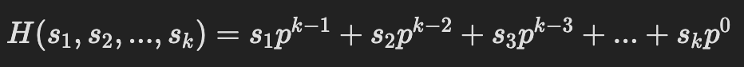

# Basics

_**Hash functions**_ are used to map large data sets of elements of an arbitrary length (_the **keys**_) to smaller data sets of elements of a fixed length (_the **fingerprints**_).

The basic application of hashing is efficient testing of equality of keys by comparing their fingerprints.

A _collision_ happens when two different keys have the same fingerprint. The way in which collisions are handled is crucial in most applications of hashing. Hashing is particularly useful in construction of efficient practical algorithms.

### Rolling Hash

A _**rolling hash**_ (also known as recursive hashing or rolling checksum) is a hash function where the input is hashed in a window that moves through the input.

A few hash functions allow a rolling hash to be computed very quickly — the new hash value is rapidly calculated given only the following data:

* old hash value,
* the old value removed from the window,
* and the new value added to the window.

### Polynomial String Hashing

An ideal hash function for strings should obviously depend both on the _**multiset**_ of the symbols present in the key and on the _**order**_ of the symbols. The most common family of such hash functions treats the symbols of a string as coefficients of a _polynomial_ with an integer variable $$p$$ and computes its value modulo an integer constant $$M$$:

The _**Rabin–Karp string search algorithm**_ is often explained using a very simple rolling hash function that only uses multiplications and additions - _**polynomial rolling hash**_:

<figure><figcaption></figcaption></figure>

Where $$p$$ is a constant, and $$(s1​,s2​,...,sk​)$$ are the input characters.

For example we can convert short strings to key numbers by multiplying digit codes by powers of a constant. The three letter word `ace` could turn into a number by calculating:

<figure><figcaption></figcaption></figure>

In order to avoid manipulating huge $$H$$ values, all math is done modulo $$M$$.

<figure><figcaption></figcaption></figure>

A careful choice of the parameters $$M$$, $$p$$ is important to obtain good properties of the hash function, i.e., low collision rate.

This approach has the desirable attribute of involving all the characters in the input string. The calculated key value can then be hashed into an array index in the usual way:

```js
function hash(key, arraySize) {
  const base = 13

  let hash = 0
  for (let charIndex = 0; charIndex < key.length; charIndex += 1) {
    const charCode = key.charCodeAt(charIndex)
    hash += charCode * base ** (key.length - charIndex - 1)
  }

  return hash % arraySize
}
```

The `hash()` method is not as efficient as it might be. Other than the character conversion, there are two multiplications and an addition inside the loop. We can eliminate one multiplication by using [Horner’s method](https://en.wikipedia.org/wiki/Horner's\_method):

<figure><figcaption></figcaption></figure>

The `hash()` cannot handle long strings because the hashVal exceeds the size of int. Notice that the key always ends up being less than the array size. In Horner’s method we can apply the modulo (%) operator at each step in the calculation. This gives the same result as applying the modulo operator once at the end, but avoids the overflow.

```js
function hash(key, arraySize) {
  const base = 13

  let hash = 0
  for (let charIndex = 0; charIndex < key.length; charIndex += 1) {
    const charCode = key.charCodeAt(charIndex)
    hash = (hash * base + charCode) % arraySize
  }

  return hash
}
```

Polynomial hashing has a rolling property: the fingerprints can be updated efficiently when symbols are added or removed at the ends of the string (provided that an array of powers of p modulo M of sufficient length is stored). The popular Rabin–Karp pattern matching algorithm is based on this property.
